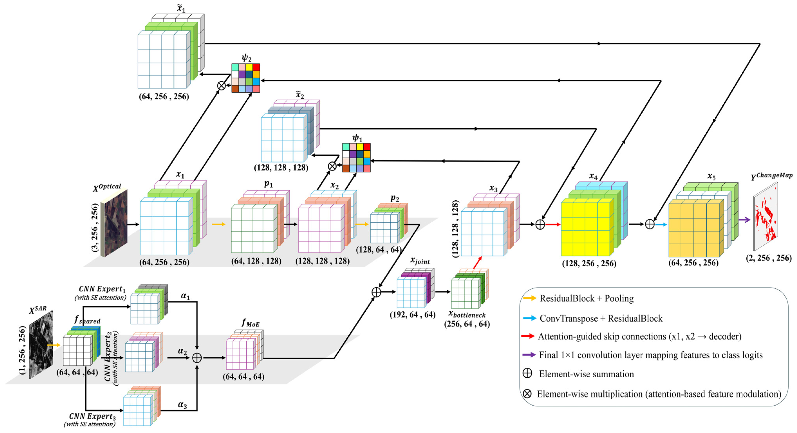
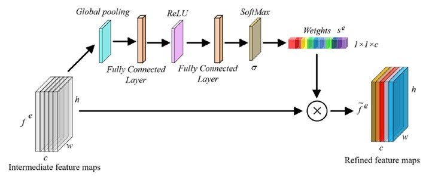
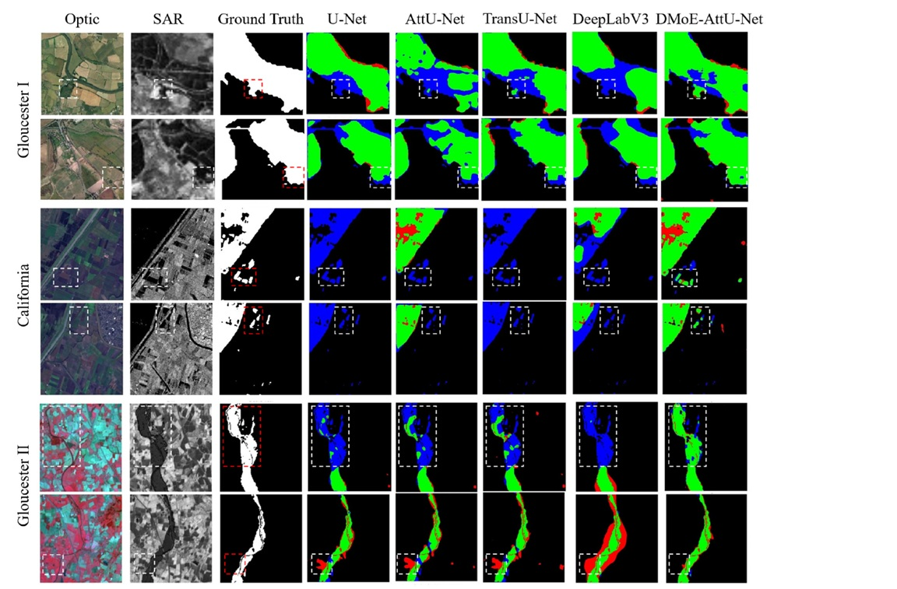

# 🌍 A Dual-Modal Mixture-of-Experts Attention U-Net (DMoE-AttU-Net) for Change Detection Using Heterogeneous Optical and SAR Remote Sensing Images

<div align="center">

### 📄 Official Repository for the DMoE-AttU-Net Framework

[]()
[]()
[]()
[]()

</div>

---

## 🖼️ Framework Overview

<p align="center">
  
  
  
</p>

<p align="center">
<b>Figure 1.</b> Overall architecture of the proposed DMoE-AttU-Net framework.  
<b>Figure 2.</b> Squeeze-and-Excitation (SE) attention module used in the SAR experts.  
<b>Figure 3.</b> Visual comparison of change detection results across benchmark datasets.
</p>

---

# 📚🔗 Journal Information & Paper Link

- 🏛️ **Journal:** Remote Sensing  
- 📅 **Year:** 2026  
- 📖 **Volume:** 18  
- 🔗 **DOI:** https://www.mdpi.com/2072-4292/18/10/1508 

---
# 📌 Abstract

Binary Change Detection (BCD) using heterogeneous optical and SAR imagery remains challenging due to modality-specific noise characteristics and ineffective feature fusion strategies. Existing approaches often struggle with suppressing SAR speckle noise while accurately preserving fine structural boundaries.

To address these limitations, we propose a novel deep learning architecture named **Dual-Modal Mixture-of-Experts Attention U-Net (DMoE-AttU-Net)**. The proposed framework incorporates:

- 🔹 Dual-stream encoders for modality-specific feature extraction  
- 🔹 A Mixture-of-Experts (MoE) module with a dynamic gating mechanism in the SAR branch  
- 🔹 Squeeze-and-Excitation (SE) and spatial attention modules for adaptive feature refinement  
- 🔹 Hierarchical skip connections for enhanced multi-scale feature fusion  

Unlike conventional multimodal change detection methods that apply uniform fusion strategies, the proposed architecture introduces a **modality-aware fusion mechanism** specifically designed for SAR imagery. This enables adaptive suppression of speckle noise while preserving complementary optical information.

Extensive experiments conducted on three heterogeneous optical–SAR benchmark datasets demonstrate that the proposed method achieves superior performance with:

- ✅ **Mean IoU:** 0.855  
- ✅ **Kappa Coefficient:** 0.836  

The results confirm improved spatial consistency, enhanced boundary localization, and reduced noise-induced artifacts compared to existing state-of-the-art approaches.

---

# 🛰️ Dataset information

All the datasets analyzed during the current study are part of the
benchmark multi-modal change detection dataset. The heterogeneous California data set is kindly
available online at http address https://sites.google.com/view/luppino/data (last accessed on
5 May 2025). The Gloucester I and II are also publicly accessible via the following
repository: https://www.iro.umontreal.ca/~mignotte/ResearchMaterial/ (last accessed on 5 May
2025).

---

# 📊 Experimental Results


# 👨‍💻 Authors

- 👤 [Seyed Ehsan Khankeshizadeh](https://www.researchgate.net/profile/Ehsan-Khankeshizadeh?ev=hdr_xprf)  
- 👤 [Ali Mohammadzadeh](researchgate.net/profile/Ali-Mohammadzadeh-7/research?_tp=eyJjb250ZXh0Ijp7InBhZ2UiOiJwcm9maWxlIiwicHJldmlvdXNQYWdlIjoicHJvZmlsZSJ9fQ) 
- 👤 [Ali Jamali](https://www.researchgate.net/profile/Ali-Jamali)  
- 👤 [Sadegh Jamali](https://www.researchgate.net/profile/Sadegh-Jamali)  

---

# 📖 Citation

If you find this repository useful in your research, please consider citing our paper:

```bibtex
@article{Ehsan2026,
  title={A Dual-Modal Mixture-of-Experts Attention U-Net (DMoE-AttU-Net) for Change Detection Using Heterogeneous Optical and SAR Remote Sensing Images},
  author={Khankeshizadeh, Seyed Ehsan and Mohammadzadeh, Ali and Jamali, Ali and Jamali, Sadegh},
  journal={Remote Sensing},
  volume={18},
  pages={1508},
  year={2026},
  publisher={MDPI},
  doi={10.3390/rs18101508}
}
